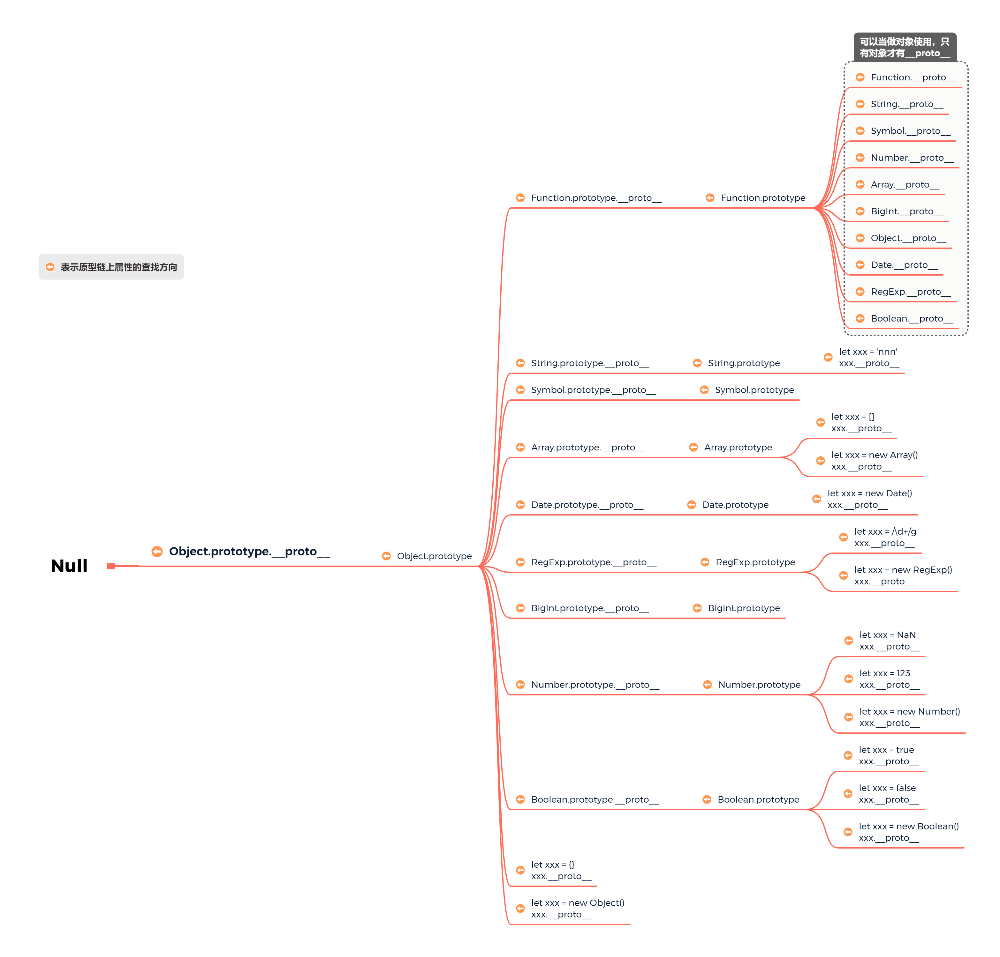

# 每天一个知识点

## 函数柯里化[Currying]

> https://www.html.cn/web/javascript/14215.html
>
> https://www.jianshu.com/p/5e1899fe7d6b

### What

> <span style='color: red;font-weight: bold;'>柯里化是</span>把接收多个参数的函数变换成接收单个参数(最初函数的第一个参数)的函数，且<span style='color: blue;font-weight: bold;'>返回</span>**可以接收其余参数并返回结果的<span style='color: blue;font-weight: bold;'>新函数</span>**的<span style='color:red; font-weight: bold;'>技术</span>

### How

#### 示例

```js
// 普通函数
function add (x, y) {
    return x + y;
}

// 柯里化后
let curryingAdd = function (x) {
    return function (y) {
        return x + y;
    }
}

// 使用
let increment = curryingAdd(1);

let addTen = curryingAdd(10);

console.log(increment(2));// 3
console.log(addTen(2));// 12
```

#### 实现

```js
// 通用封装，这样返回的话其实只能多扩展一个参数，不支持currying(a)(b)(c)
let currying = function (fn, ...args) {
    return function (...newArgs) {
    	return fn.apply(this, [...args, ...newArgs]);
    }
}

// 支持多参数调用
function progressCurrying(fn, ...args) {
    const len = fn.length; // 函数的形参个数
    return function (...newArgs) {
        newArgs = [...newArgs, ...args];
        // 如果参数个数小于最初的fn.length，则递归调用，继续收集参数
        if (newArgs.length < len) {
            return progressCurrying.apply(this, fn, newArgs);
        }
        return fn.apply(this, newArgs);
    }
}

// 使用
let add = function (x) {
	return function (y) {
		return x + y;
	};
};
let add2 = progressCurrying(add);
console.log(add2(1)(2));
```

### Why

#### 一、参数复用

```js
// 正常正则验证字符串 reg.test(txt);

// 函数封装后
function check (reg, txt) {
    return reg.test(txt);
}
check(/\d+/g, 'test');  // false
check(/[a-z]+/g, 'test');  // true

// Currying后
function curryingCheck (reg) {
    return function (txt) {
        return reg.test(txt);
    }
}

let hasNumber = curryingCheck(/\d+/g);
let hasLetter = curryingCheck(/[a-z]+/g);

console.log(hasNumber('test1')); // true
console.log(hasNumber('testtest')); // false
console.log(hasLetter('121212')); // false
```

#### 二、提前确认

```js
let on = function (element, event, handler) {
    if (document.addEventListener) {
        if (element && event && handler) {
            element.addEventListener(event, handler, false);
        }
    } else {
        if (element && event && handler) {
            element.attachEvent('on' + event, handler);
        }
    }
}

// Currying后
let on = (function () {
    if (document.addEventListener) {
        return function (element, event, handler) {
            if (element && event && handler) {
                element.addEventListener(event, handler, false);
            }
        }
    } else {
        return function (element, event, handler) {
            if (element && event && handler) {
                element.attachEvent('on' + event, hanndler);
            }
        }
    }
})();

// 另一种写法
let on = function (isSupport, element, event, handler) {
    isSupport = isSupport || document.addEventListener;
    if (isSupport) {
        return element.addEventListener(event, handler, false);
    } else {
        return element.attachEvent('on' + event, handler);
    }
}
```

#### 三、延迟计算/运行

```js
Function.prototype.bind = function (thisArg, ...args) {
    return function () {
        return this.apply(thisArg, args);
    }
}
```

### 一道面试题

> ```
> // 实现一个add方法，使计算结果能够满足如下预期：
> add(1)(2)(3) = 6;
> add(1, 2, 3)(4) = 10;
> add(1)(2)(3)(4)(5) = 15;
> ```

```js
function add (...args) {
	// 1. 使用闭包特性收集参数
	let _adder = function (...newArgs) {
		args.push(...newArgs);
		return _adder;
	}
	// 2. 计算得出最后结果
	_adder.toString = function () {
		return args.reduce((a, b) => a + b);
	}
	// 3. 返回一个函数[柯里化]
	return _adder;
}

总结：
	1. 柯里化返回新函数
    2. 收集参数
    3. 上面两步同时进行，需要获取结果的时候使用收集到的参数计算结果
```

## 原型

> https://developer.mozilla.org/zh-CN/docs/Learn/JavaScript/Objects/Object_prototypes
>
> https://developer.mozilla.org/zh-CN/docs/Web/JavaScript/Reference/Global_Objects/Object
>
> https://developer.mozilla.org/zh-CN/docs/Web/JavaScript/Reference/Global_Objects/Function

> JavaScript 常被描述为一种**基于原型的语言 (prototype-based language)**——每个对象拥有一个**原型对象**，<span style='color: red; font-weight: bold;'>对象以其原型为模板、从原型继承方法和属性</span>。原型对象也可能拥有原型，并从中继承方法和属性，一层一层、以此类推。这种关系常被称为**原型链 (prototype chain)**，它解释了为何一个对象会拥有定义在其他对象中的属性和方法。
>
> 准确地说，这些属性和方法定义在Object的构造器函数(constructor functions)之上的`prototype`属性上，而非对象实例本身。
>
> 在传统的 OOP 中，首先定义“类”，此后创建对象实例时，类中定义的所有属性和方法都被复制到实例中。在 JavaScript 中并不如此复制——而是在对象实例和它的构造器之间建立一个链接（它是__proto__属性，是从构造函数的`prototype`属性派生的），之后通过上溯原型链，在构造器中找到这些属性和方法。

### `prototype`

指向构造函数的原型

只有<span style='color: blue; font-weight: bold;'>函数</span>拥有`prototype`

### `constructor`	

### `__proto__`

指向对象实例的构造函数的原型

只有<span style='color: blue; font-weight: bold;'>对象实例</span>拥有`__proto__`。**对象实例就是使用函数创建的对象。**

比如:

```js
let a = {};
function B() {}
let xxx = new B();
let arr = [];

// a, xxx, arr都是对象实例
```

### `prototype`和`__proto__`的关系

```js
function A () {}
let a = new A();
console.log(a.__proto__ === A.prototype); // true
let arr = [];
console.log(arr.__proto__ === Array.prototype); // true
```

### 为什么这里不输出`undefined`？

```js
function A() {}
console.log(A.__proto__); // 并不输出undefined，说明函数A有`__proto__`属性
```

> 在JavaScript中，**<span style='color: red;'>几乎所有的对象都是`Object`类型的实例</span>**，它们都会从`Object.prototype`继承属性和方法。
>
> 每个 <span style='color: red; font-weight: bold;'>JavaScript 函数</span>实际上都**<span style='color: red;'>是</span>**一个 `Function` <span style='color: red; font-weight: bold;'>对象</span>。运行 `(function(){}).constructor === Function // true` 便可以得到这个结论。

由`MDN`的解释可知，在`JavaScript`中函数也是一个`Object`的实例，而对象实例都有`__proto__`属性，所以`A.__proto__`是存在的。

### 原型链

由于知识范围有限，所以`Symbol`和`BigInt`的创建这里没有举例列出。



如果某个属性在当前对象上查找不到，`JavaScript`就会按照`xxx.__proto__.__proto__....`的顺序查找直到找到对应的属性名称/Null为止，找到后即返回，不再向后继续查找。例如

```js
Object.prototype.mName = 'Object';
Object.prototype.xxx = 'xxx';
Number.prototype.mName = 'mNmaee os Number';
Number.prototype.mFunc = 'suio Func';
let count = 123;
// 因为count是数字类型，所以这里的属性不能被添加到count上
count.mName = '123';
console.log(count); // 123
// 在Number的原型上定义的
console.log(count.mName); // mNmaee os Number
// 在Number的原型上定义的
console.log(count.mFunc); // suio Func
// 在Object的原型上定义的[原型链：count.__proto__ => Number.prototype => Number.prototype.__proto__ => Object.prototype]
console.log(count.xxx); // xxx

let obj = {
    mName: 'obj',
    mFunc () {
        console.log('mFunc');
    }
};
console.log(obj); // {mName: "obj", mFunc: ƒ}
// obj对象上定义的
console.log(obj.mName); // obj
// obj对象上定义的
console.log(obj.mFunc); // ƒ mFunc () {console.log('mFunc');}
// Object原型上定义的[原型链：obj.__proto__ => Object.prototype]
console.log(obj.xxx); // xxx
```

## 跨域

> https://mp.weixin.qq.com/s/_XFwDaIaE91d5evxDRgtLw
>
> https://developer.mozilla.org/zh-CN/docs/Web/Security/Same-origin_policy

### 什么是跨域

跨域本质上是浏览器基于**同源策略**的一种安全手段。

同源策略：是一个重要的安全策略，用于限制一个`origin`的文档或者它加载的脚本如何能与另一个源的资源进行交互。它能帮助阻隔恶意文档，减少可能被攻击的媒介。

#### 同源

如果两个`URL`的协议、主机、端口都相同，则这两个`URL`是同源

下表给出了与 URL `http://store.company.com/dir/page.html` 的源进行对比的示例:

| URL                                               | 结果 | 原因                               |
| :------------------------------------------------ | :--- | :--------------------------------- |
| `http://store.company.com/dir2/other.html`        | 同源 | 只有路径不同                       |
| `http://store.company.com/dir/inner/another.html` | 同源 | 只有路径不同                       |
| `https://store.company.com/secure.html`           | 失败 | 协议不同                           |
| `http://store.company.com:81/dir/etc.html`        | 失败 | 端口不同 ( `http://` 默认端口是80) |
| `http://news.company.com/dir/other.html`          | 失败 | 主机不同                           |

### 解决跨域的三种方案

> https://blog.csdn.net/qq_38128179/article/details/84956552

#### JSONP

> JSONP 是服务器与客户端跨源通信的常用方法。最大特点就是简单适用，兼容性好（兼容低版本IE），<span style='color: red; font-weight: bold;'>缺点是只支持get请求，不支持post请求。</span>
>
> 核心思想：网页通过添加一个`<script>元素`，向服务器请求 JSON 数据，<span style='color: red;'>**服务器收到请求后，将数据放在一个指定名字的回调函数的参数位置传回来。**</span>

##### 原生实现

```html
<script src="http://test.com/data.php?callback=dosomething"></script>
// 向服务器test.com发出请求，该请求的查询字符串有一个callback参数，用来指定回调函数的名字
 
// 处理服务器返回回调函数的数据
<script type="text/javascript">
    function dosomething(res){
        // 处理获得的数据
        console.log(res.data)
    }
</script>
```

##### JQuery's ajax

```js
$.ajax({
    url: 'http://www.test.com:8080/login',
    type: 'get',
    dataType: 'jsonp',  // 请求方式为jsonp
    jsonpCallback: "handleCallback",    // 自定义回调函数名
    data: {}
});
```

##### Vue

```js
this.$http.jsonp('http://www.domain2.com:8080/login', {
    params: {},
    jsonp: 'handleCallback'
}).then((res) => {
    console.log(res); 
})
```

#### CORS

> https://developer.mozilla.org/zh-cn/docs/Glossary/CORS
>
> https://developer.mozilla.org/zh-CN/docs/Web/HTTP/Access_control_CORS
>
> https://www.cnblogs.com/itmacy/p/6958181.html

> **CORS** （Cross-Origin Resource Sharing，跨域资源共享）是一个系统，它由一系列传输的[HTTP头](https://developer.mozilla.org/en-US/docs/Glossary/Header)组成，这些HTTP头决定浏览器是否阻止前端 JavaScript 代码获取跨域请求的响应。
>
> [同源安全策略](https://developer.mozilla.org/zh-CN/docs/Web/Security/Same-origin_policy) 默认阻止“跨域”获取资源。但是 CORS 给了web服务器这样的权限，即服务器可以选择，允许跨域请求访问到它们的资源。
>
> **跨源资源共享** ([CORS](https://developer.mozilla.org/zh-CN/docs/Glossary/CORS)) （或通俗地译为跨域资源共享）是一种基于[HTTP](https://developer.mozilla.org/zh-CN/docs/Glossary/HTTP) 头的机制，该机制通过允许服务器标示除了它自己以外的其它[origin](https://developer.mozilla.org/zh-CN/docs/Glossary/源)（域，协议和端口），这样浏览器可以访问加载这些资源。跨源资源共享还通过一种机制来检查服务器是否会允许要发送的真实请求，该机制通过浏览器发起一个到服务器托管的跨源资源的"预检"请求。在预检中，浏览器发送的头中标示有HTTP方法和真实请求中会用到的头。
>
> 跨源资源共享标准新增了一组 HTTP 首部字段，<span style='color:red; font-weight: bold;'>允许<span style='color: blue;'>服务器声明</span>哪些源站通过浏览器有权限访问哪些资源。</span>另外，规范要求，对那些可能对服务器数据产生副作用的 HTTP 请求方法（特别是 [`GET`](https://developer.mozilla.org/zh-CN/docs/Web/HTTP/Methods/GET) 以外的 HTTP 请求，或者搭配某些 MIME 类型的 [`POST`](https://developer.mozilla.org/zh-CN/docs/Web/HTTP/Methods/POST) 请求），浏览器必须首先使用 [`OPTIONS`](https://developer.mozilla.org/zh-CN/docs/Web/HTTP/Methods/OPTIONS) 方法发起一个预检请求（preflight request），从而获知服务端是否允许该跨源请求。服务器确认允许之后，才发起实际的 HTTP 请求。在预检请求的返回中，服务器端也可以通知客户端，是否需要携带身份凭证（包括 [Cookies ](https://developer.mozilla.org/zh-CN/docs/Web/HTTP/Cookies)和 HTTP 认证相关数据）。

**普通跨域请求**

只需服务器端设置`Access-Control-Allow-Origin`

**带Cookie的跨域请求**

前后端都需要设置

##### 前端设置

###### 原生实现

根据`xhr.withCredentials`字段判断是否带有`cookie`

```js
var xhr = new XMLHttpRequest(); // IE8/9需用window.XDomainRequest兼容
 
// 前端设置是否带cookie
xhr.withCredentials = true;
 
xhr.open('post', 'http://www.domain2.com:8080/login', true);
xhr.setRequestHeader('Content-Type', 'application/x-www-form-urlencoded');
xhr.send('user=admin');
 
xhr.onreadystatechange = function() {
    if (xhr.readyState == 4 && xhr.status == 200) {
        alert(xhr.responseText);
    }
};
```

###### JQuery's ajax

```js
$.ajax({
   url: 'http://www.test.com:8080/login',
   type: 'get',
   data: {},
   xhrFields: {
       withCredentials: true    // 前端设置是否带cookie
   },
   crossDomain: true,   // 会让请求头中包含跨域的额外信息，但不会含cookie
});
```

###### vue-resource

```js
Vue.http.options.credentials = true
```

###### axios

```js
axios.defaults.withCredentials = true
```

##### 服务器端设置

> 服务器端对于CORS的支持，主要是通过设置Access-Control-Allow-Origin来进行的。如果浏览器检测到相应的设置，就可以允许Ajax进行跨域的访问。

###### Java后台

```java
/*
 * 导入包：import javax.servlet.http.HttpServletResponse;
 * 接口参数中定义：HttpServletResponse response
 */
 
// 允许跨域访问的域名：若有端口需写全（协议+域名+端口），若没有端口末尾不用加'/'
response.setHeader("Access-Control-Allow-Origin", "http://www.domain1.com"); 
 
// 允许前端带认证cookie：启用此项后，上面的域名不能为'*'，必须指定具体的域名，否则浏览器会提示
response.setHeader("Access-Control-Allow-Credentials", "true"); 
 
// 提示OPTIONS预检时，后端需要设置的两个常用自定义头
response.setHeader("Access-Control-Allow-Headers", "Content-Type,X-Requested-With");
```

###### NodeJS后台

```js
var http = require('http');
var server = http.createServer();
var qs = require('querystring');
 
server.on('request', function(req, res) {
    var postData = '';
 
    // 数据块接收中
    req.addListener('data', function(chunk) {
        postData += chunk;
    });
 
    // 数据接收完毕
    req.addListener('end', function() {
        postData = qs.parse(postData);
 
        // 跨域后台设置
        res.writeHead(200, {
            'Access-Control-Allow-Credentials': 'true',     // 后端允许发送Cookie
            'Access-Control-Allow-Origin': 'http://www.domain1.com',    // 允许访问的域（协议+域名+端口）
            /* 
             * 此处设置的cookie还是domain2的而非domain1，因为后端也不能跨域写cookie(nginx反向代理可以实现)，
             * 但只要domain2中写入一次cookie认证，后面的跨域接口都能从domain2中获取cookie，从而实现所有的接口都能跨域访问
             */
            'Set-Cookie': 'l=a123456;Path=/;Domain=www.domain2.com;HttpOnly'  // HttpOnly的作用是让js无法读取cookie
        });
 
        res.write(JSON.stringify(postData));
        res.end();
    });
});
 
server.listen('8080');
console.log('Server is running at port 8080...');
```

###### PHP后台

```php
<?php
 header("Access-Control-Allow-Origin:*");
```

###### Apache

Apache需要使用mod_headers模块来激活HTTP头的设置，它默认是激活的。你只需要在Apache配置文件的`<Directory>`,` <Location>`,` <Files>`或`<VirtualHost>`的配置里加入以下内容即可

```javascript
Header set Access-Control-Allow-Origin *
```

#### Proxy

> 代理（Proxy）也称网络代理，是一种特殊的网络服务，允许一个（一般为客户端）通过这个服务与另一个网络终端（一般为服务器）进行非直接的连接。一些网关、路由器等网络设备具备网络代理功能。一般认为代理服务有利于保障网络终端的隐私或安全，防止攻击.

##### 方案一

如果是通过`vue-cli`脚手架工具搭建项目，我们可以通过`webpack`为我们起一个本地服务器作为请求的代理对象

通过该服务器转发请求至目标服务器，得到结果再转发给前端，但是最终发布上线时如果web应用和接口服务器不在一起仍会跨域

在`vue.config.js`文件，新增以下代码

```
amodule.exports = {
    devServer: {
        host: '127.0.0.1',
        port: 8084,
        open: true,// vue项目启动时自动打开浏览器
        proxy: {
            '/api': { // '/api'是代理标识，用于告诉node，url前面是/api的就是使用代理的
                target: "http://xxx.xxx.xx.xx:8080", //目标地址，一般是指后台服务器地址
                changeOrigin: true, //是否跨域
                pathRewrite: { // pathRewrite 的作用是把实际Request Url中的'/api'用""代替
                    '^/api': "" 
                }
            }
        }
    }
}
```

通过`axios`发送请求中，配置请求的根路径

```
axios.defaults.baseURL = '/api'
```

##### 方案二

此外，还可通过服务端实现代理请求转发

以`express`框架为例

```
var express = require('express');
const proxy = require('http-proxy-middleware')
const app = express()
app.use(express.static(__dirname + '/'))
app.use('/api', proxy({ target: 'http://localhost:4000', changeOrigin: false
                      }));
module.exports = app
```

##### 方案三

通过配置`nginx`实现代理

```
server {
    listen    80;
    # server_name xxx.xxx.com;
    location / {
        root  /var/www/html;
        index  index.html index.htm;
        try_files $uri $uri/ /index.html;
    }
    location /api {
        proxy_pass  http://127.0.0.1:3000;
        proxy_redirect   off;
        proxy_set_header  Host       $host;
        proxy_set_header  X-Real-IP     $remote_addr;
        proxy_set_header  X-Forwarded-For  $proxy_add_x_forwarded_for;
    }
}
```

## 虚拟DOM

### 什么是虚拟DOM

### 为什么需要虚拟DOM

### 如何实现虚拟DOM